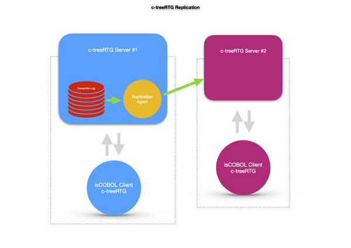

# Data Replication

## Overview

The c-tree server includes a Replication Agent, a component acting as a conduit to pass data from transaction log entries on a master server to a local server. The Replication Agent is responsible for establishing connections to both c-tree database engines, maintaining a current position in case of connection failures, and logging exceptional transactions that cannot be reliably replicated.

The Replication Agent provides the ability to replicate data from one c-tree database engine instance to another.

The Replication Agent can be activated on the same machine as the production database engine or on the backup copy of the database engine. Best practice is generally to run the agent on the same machine as the backup database engine for optimal throughput.

