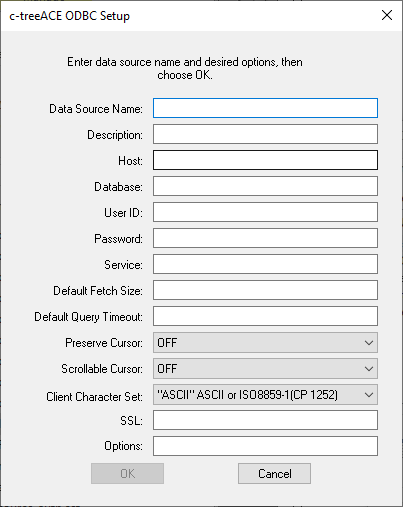

## ODBC Driver

The ODBC Driver is installed on Windows machines along with c-tree if the proper option is checked. See the [Installing on Windows](../../Installing-c-tree/Installing-on-Windows) chapter for details.

After the installation, you can create a DSN by following these steps:

1. Open Control Panel, Administrative Tools, ODBC Data Sources
2. Switch between User and System pages depending on the type of DSN you wish to create.
3. Click on ADD button
4. Choose "FairCom ODBC Driver" from the list of drivers

The following panel will appear:

Fill it in as follows:

- *Data Source Name*: name of the DSN. It's the name that will be used by ODBC clients to reach the datasource.
- *Description*: optional commentary info for the DSN.
- *Host*: IP address or server name of the pc in which c-tree Server is started.
- *Database*: name of the database (i.e. "ctreeSQL”).
- *User ID*: name of the user (i.e. "admin”).
- *Password*: password of the user (i.e. "ADMIN”).
- *Service*: name of the Service FairCom DB SQL listens to. If empty, sqlnw is used.
- *Default Fetch Size*: size (in bytes) used by the driver to fetch multiple rows from the server. It reduces network requests resulting in performance gains. If not set, the internal buffer size is 5000 bytes.
- *Default Query Timeout*: query timeout (in seconds).
- *Preserve Cursor*: this behavior is configurable from within the ODBC administrator.
- *Scrollable Cursor*: allows you to enable support for ODBC applications that require a scrollable cursor.
- *Client Character Set*: the character set used by the client.
- *SSL*: optional parameters to configure the SSL. Leave the field blank to not use SSL, type BASIC to use SSL without certificate checking or input a certificate file name to use SSL with certificate checking using the certificate file specified. If no path is entered, the file must be in the current working directory.
- *Options*: any optional parameters to be included in the connect string.

### Other platforms

On other platforms, the ODBC Driver is provided as a shared library that you can link to your ODBC client program. The library is stored under *drivers/sql.odbc* in the c-tree directory.

Consult Faircom’s documentation for additional information.
