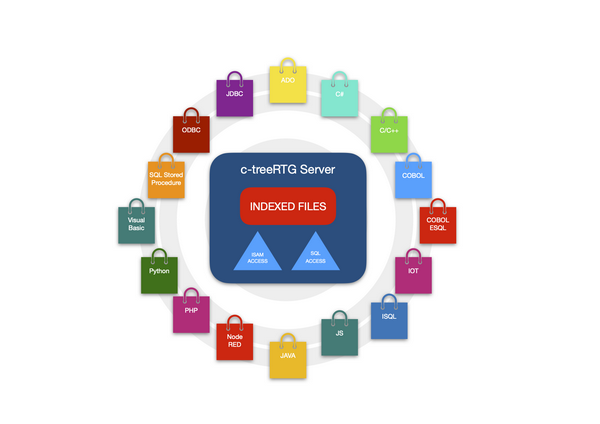

# Installing c-tree

c-treeRTG (also called simply c-tree) is a file server. It’s composed of a server (the c-tree Server) and a client (the c-tree client library) that can be installed on the same machine or on different machines.

Each time an i/o operation is issued, the client sends a request to the server and the server part operates locally on the server machine.

This kind of approach provides a fast and secure access to remote files and it’s a strongly suggested alternative to shared directories.

c-tree can also work as a database. isCOBOL accesses its files with standard i-o statements, but other tools, like Ms Office applications and other ODBC and JDBC clients can work on these files through SQL.

