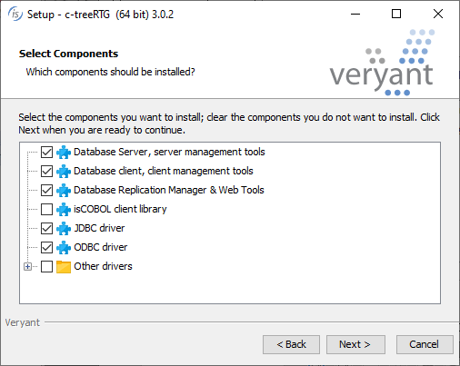
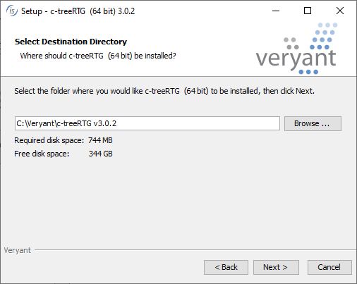
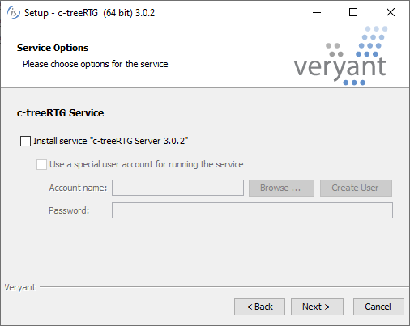

## Installing on Windows

c-tree provides a graphical setup wizard for the installation on Windows.

First of all, you have to choose which kind of installation to perform.

- *Database Server* is the full server installation. If this option is checked, server products will be installed on the PC.
- *Database Client* is the client installation. If this option is checked, client database tools are installed.
- *isCOBOL client library* is the c-tree client installation. If this option is checked, the client library (ctree.dll) will be installed The setup will ask for the destination directory later.
- *COBOL drivers*, if checked, installs the import libraries to include c-tree in C-based COBOL runtimes like ACUCOBOL-GT and RM/COBOL.
- *ODBC driver*, if checked, installs the ODBC driver for c-tree.
- *JDBC driver*, if checked, installs the JDBC driver for c-tree.
- *Drivers and API* is a collection of drivers to interface c-tree with other programming languages like PHP, C# and Python.

If *isCOBOL client library* was checked, the next step will let you choose which version of isCOBOL will be updated with the c-tree client library.

The setup lets you select the path in which the c-tree and its utilities will be installed.

If Database Server was checked, the setup lets you create a Windows service for the c-tree Server

The service must be managed via the sc command or the Windows Service Manager, as explained in [Windows Service](../Server-Startup/Startup-on-Windows#windows-service).
