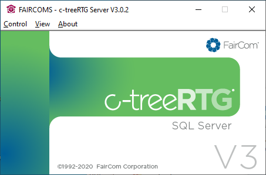
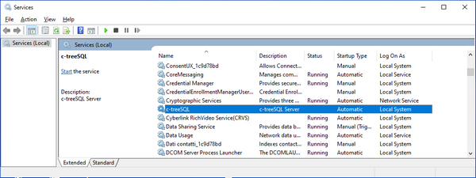

## Startup on Windows

In order to start the c-tree Server in foreground mode, launch ‘ctreesql.exe’. You can run it from the Windows Start menu: *Start > Programs > c-treeRTG v5.1.1 > c-treeRTG Server*

Unless the entry [CONSOLE TOOL_TRAY](../Configuring-the-c-tree-Server#console_tool_tray) is present in the *ctsrvr.cfg* file, the following panel will appear.



Also, a new icon will appear in the system tray.

From the *View* menu you can hide the Message Monitor or show the Function Monitor (list of all internal functions called from clients). From the *Control* menu you can shut down the server. The same result is obtained by clicking on its window close button.

The c-tree Server can also be started from a command prompt by running the *faircom.exe* file installed in the c-treeRTG "server" folder. It is the same executable file pointed by the link mentioned above. The faircom executable file supports command-line parameters allowing you to specify configuration options or a custom configuration file directly on the command-line; see [The faircom executable command-line](./The-faircom-executable-command-line) for details.

### Windows Service

In order to start the c-tree Server in background mode, you must create a service.

If you didn’t create the service during the setup process, you can start an MS-DOS prompt with Administrator privileges and run:

```cobol
sc create c-treeSQL start= auto binPath= "C:\Veryant\c-treeRTG v5.1.1\server\faircom.exe"
```

**Note** - "c-treeSQL" is just a suggested name, but any name can be used. The path to *faircom.exe* might be different on your machine.

After it, you can optionally assign a description to the service as follows:

```cobol
sc description c-treeSQL "c-treeSQL Server"
```

If the above commands are successful, you will find this new service available in the Service Control Manager:



You can manage the c-treeSQL service from the Service Control Manager or by running other sc commands in the MS-DOS prompt.

For more information about the sc command, refer to Microsoft documentation: [https://technet.microsoft.com/en-us/library/bb490995.aspx.](https://technet.microsoft.com/en-us/library/bb490995.aspx)

To remove the service from the system, use this command:

```cobol
sc delete c-treeSQL
```

### Starting multiple services on the same machine

In this example we show how to start two c-tree Server services listening on different ports on the same machine.

1. Make a copy of the existing ctsrvr.cfg configuration file, e.g.

```cobol
cd C:\Veryant\c-treeRTG v5.1.1\config
copy ctsrvr.cfg ctsrvr2.cfg
```

2. Edit the ctsrvr2.cfg configuration file and change the following entries to different unique values:

- SERVER_NAME
- SERVER_PORT
- SQL_PORT
- LOCAL_DIRECTORY
- LOG_EVEN
- LOG_ODD
- START_EVEN
- START_ODD

3. Create the two services as follows:

```cobol
sc create c-treeSQL-1 start= auto binPath= "C:\Veryant\c-treeRTG v5.1.1\server\faircom.exe CTSRVR_CFG C:\Veryant\c-treeRTG v5.1.1\config\ctsrvr.cfg"
 
sc create c-treeSQL-2 start= auto binPath= "C:\Veryant\c-treeRTG v5.1.1\server\faircom.exe CTSRVR_CFG C:\Veryant\c-treeRTG v5.1.1\config\ctsrvr2.cfg"
```
