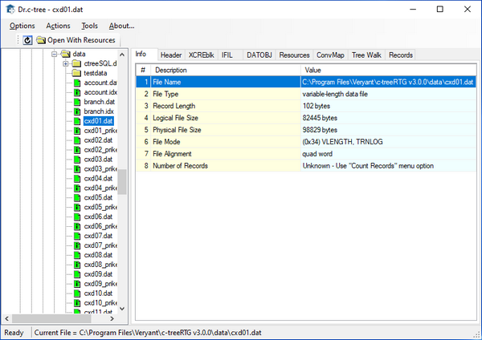

#### DrCtree.jar

DrCtree allows you to browse for c-tree files on the local drive by using the file explorer on the left. When you select a c-tree file, information is displayed on the right. Right clicking on the file name or using the Actions menu, allows to perform file maintenance actions, like rebuild the file, for example.

Refer to Faircom’s documentation for more information about this utility.
