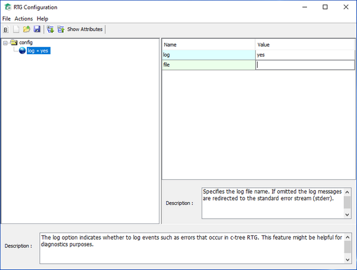

#### RTGConfig.jar

RTGConfig allows you to create and maintain client side configuration files (CTREE\_CONF). It represents the XML structure of the configuration file in a tree view and provides a description for each item. You can add, edit o remove items from the tree and the changes will be reflected in the configuration file on disc.

Refer to Faircom’s documentation for more information about this utility.
