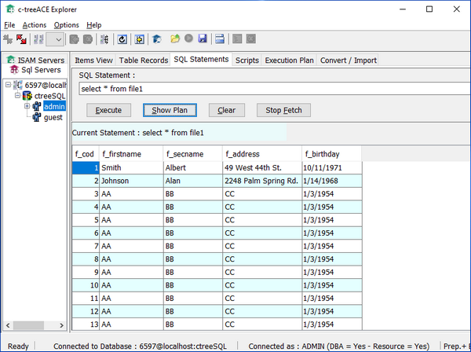

#### c-treeACEExplorer.jar

c-treeACEExplorer allows you to manage your SQL database with or without SQL code. It offers an ISAM view and a SQL view on the database.

The *Clear Database* function drops all the tables in the database. This operation also deletes sqlized archives unless you activated [SQL_OPTION DROP_TABLE_DICTIONARY_ONLY](../../../Configuring-the-c-tree-Server#sql_option_drop_table_dictionary_only) in the c-tree Server’s configuration file (ctsrvr.cfg).

Refer to Faircom’s documentation for more information about this utility.
