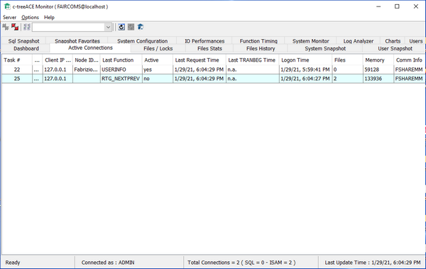

#### c-treeACEMonitor.jar

c-treeACEMonitor is a collection of various features that .NET utilities provide in separate tools. It allows you to monitor active connection as well as analyze log files, manage users and monitor performance.

Refer to Faircom’s documentation for more information about this utility.
