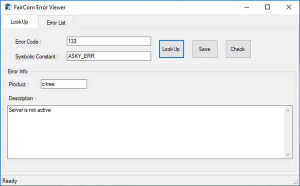

#### ErrorViewer

ErrorViewer is a graphical utility provided for the Windows platform. It provides error codes description. Type the error code in the field and press Enter (or click the “Look Up” button) to obtain the related description. Switch to the “Error List” page to see a list of known c-tree errors.

Error codes description can be found also in this documentation at [Error Codes](../../../Troubleshooting/Error-Codes).
