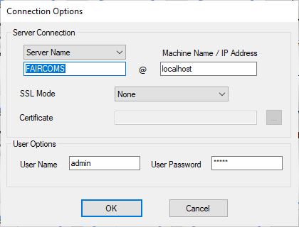

### .NET utilities

The following .NET graphical utilities are available for the Windows platform:

- [c-treeACEMonitor](./c-treeACEMonitor)
- [c-treeConfigManager](./c-treeConfigManager)
- [c-treeGauges](./c-treeGauges)
- [c-treeISAMExplorer](./c-treeISAMExplorer)
- [c-treeLoadTest](./c-treeLoadTest)
- [c-treeLogAnalyzer](./c-treeLogAnalyzer)
- [c-treePerfMon](./c-treePerfMon)
- [c-treeQueryBuilder](./c-treeQueryBuilder)
- [c-treeSecurityAdmin](./c-treeSecurityAdmin)
- [c-treeSqlExplorer](./c-treeSqlExplorer)
- [c-treeTPCATest](./c-treeTPCATest)
- [DrCtree](./DrCtree)
- [ErrorViewer](./ErrorViewer)

The executable files are installed under the “tools\\gui” folder.

All these utilities can run on the same machine as the c-tree Server as well as on a remote machine. The utilities that require to connect to the c-tree Server prompt you for connection details at startup:

