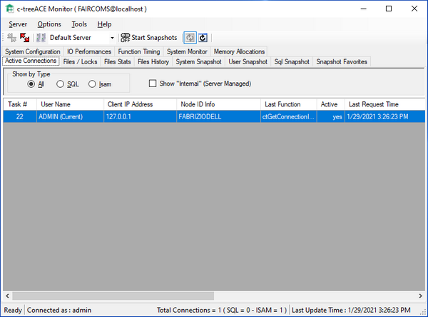

#### c-treeACEMonitor

c-treeMonitor is a graphical utility provided for the Windows platform. It monitors all the activities of the  c-tree Server through a graphical window made of multiple panels.

Refer to c-tree Server Administrator's Guide for additional information on this utility.
