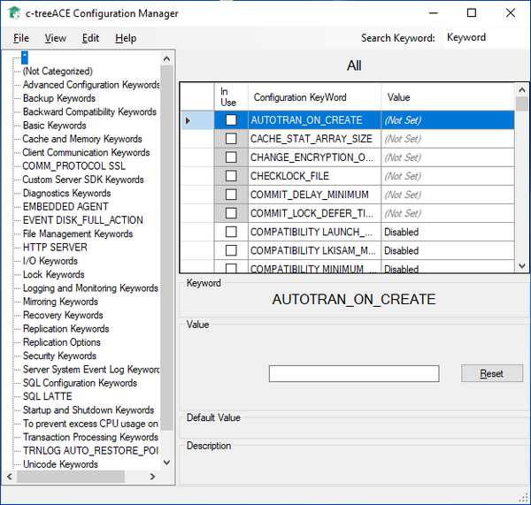

#### c-treeConfigManager

c-treeConfigManager is a graphical utility provided for the Windows platform. I allows to edit the c-tree server configuration file (ctsrvr.cfg) using a graphical interface.

Refer to c-tree Server Administrator's Guide for additional information on this utility.
