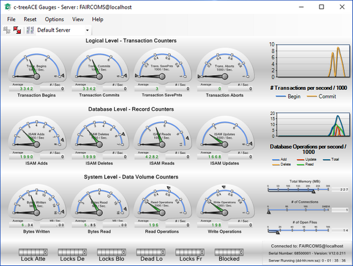

#### c-treeGauges

c-treeGauges is a graphical display of performance metrics provided for the Windows platform. While not intended as a full monitoring solution, c-treeGauges makes it easy to begin understanding the internal workings of the c-tree server.

Refer to c-tree Server Administrator's Guide for additional information on this utility.
