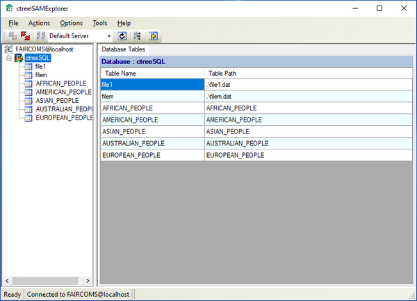

#### c-treeISAMExplorer

c-treeISAMExplorer is a graphical tool to create, view, and modify your c-tree databases without requiring SQL.

Refer to c-tree Server Administrator's Guide for additional information on this utility.
