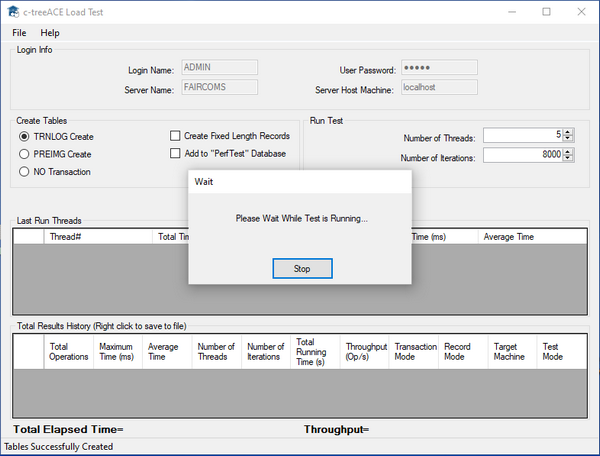

#### c-treeLoadTest

c-treeLoadTest is a graphical utility provided for the Windows platform that quickly test and analyze throughput on specific machines and configurations. With multiple options to simulate various data streams, you can easily pinpoint performance bottlenecks.

Refer to c-tree Server Administrator's Guide for additional information on this utility.
