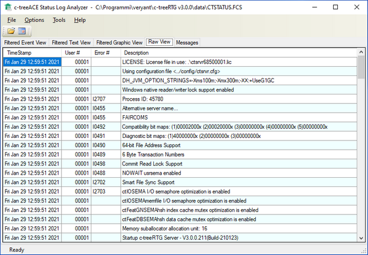

#### c-treeLogAnalyzer

c-treeLogAnalyzer is a graphical utility provided for the Windows platform. It allows to easily review the CTSTATUS.FCS log file that is created and constantly updated the c-tree server.

As the utility starts, click on the *File* menu and choose *Open*. Browse for the CTSTATUS.FCS file stored in the c-tree server directories and open it.

Refer to c-tree Server Administrator's Guide for additional information on this utility.
