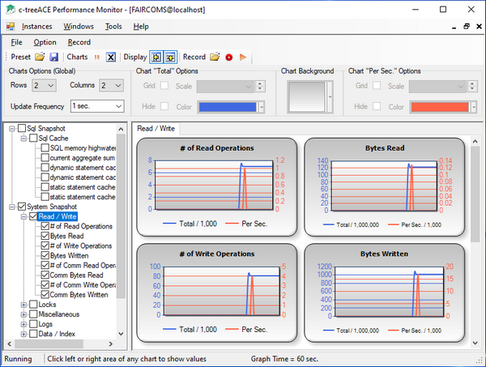

#### c-treePerfMon

c-treePerfMon is a graphical utility provided for the Windows platform. It graphically displays critical c-tree operational parameters in real time enabling you to quickly spot performance bottlenecks. Sorted by functional categories, c-treePerfMon allows you to hone in on the exact metrics you wish to monitor. Everything from memory usage to the number of specific ISAM operations executed is available at a glance.

Refer to c-tree Server Administrator's Guide for additional information on this utility.
