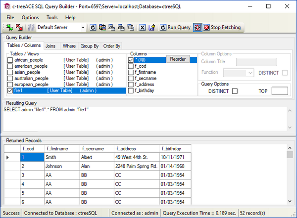

#### c-treeQueryBuilder

c-treeQueryBuilder is a graphical utility provided for the Windows platform. It’s a QBE (Query By Example) that allows you to create SQL queries from the GUI instead of writing SQL code.

1. Select the table you want to query from the *Tables/Views* list.
2. Select the column(s) you want to show from the *Columns* list.
3. Optionally switch to the pages *Joins*, *Where*, *Group By* and *Order By* to specify additional options and criteria.

The SQL query is updated in the *Resulting Query* field in real time.

The results of the query are updated in the *Resulting Records* field in real time.

Refer to c-tree Server Administrator's Guide for additional information on this utility.
