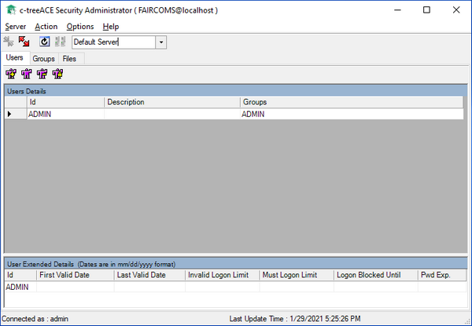

#### c-treeSecurityAdmin

c-treeSecurityAdmin is a graphical utility provided for the Windows platform. It manages the users and permissions through a graphical window composed of multiple panels.

ctreeSecurityAdmin allows to:

- Add, Delete and Modify Users
- Change User Passwords
- Create, Modify and Delete Groups
- Modify File Security Attributes
- Change File Passwords

Refer to c-tree Server Administrator's Guide for additional information on this utility.
