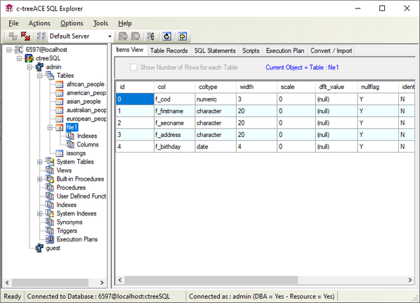

#### c-treeSqlExplorer

ctreeSqlExplorer is a graphical DBA (DataBase Administration) utility provided for the Windows platform.



From the tree menu on the left it’s possible to select the database items you wish to monitor or manage. When an item is selected, the panels on the right allow to perform the possible operations on it.

The icon before table names allows you to distinguish pure SQL tables from ISAM files that have been sqlized using the [ctutil](../../Command-line-utilities/ctutil/ctutil) utility. The icon with a blue bar identifies a pure SQL table, while the icon with an orange bar identifies a sqlized archive.

The *Clear Database* function drops all the tables in the database. This operation also deletes sqlized archives unless you activated [SQL_OPTION DROP_TABLE_DICTIONARY_ONLY](../../../Configuring-the-c-tree-Server#sql_option_drop_table_dictionary_only) in the c-tree Server’s configuration file (ctsrvr.cfg).

c-tree SQL Explorer also allows you to manage users if you start it with the following command:

```shell
c-treeSqlExplorer -adv
```

You can create a new database or add an existing database using the options in the *Actions* menu. Before adding an existing database, be sure that the database dbs folder has been copied to the server’s *data* directory.

Refer to c-tree Server Administrator's Guide for additional information on this utility.
