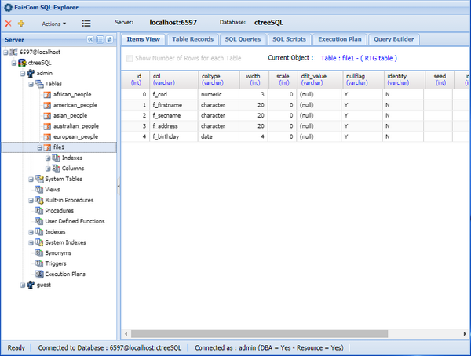

### Data Explorer

Data Explorer allows you to manage the c-treeSQL database as a relational database. You can take advantage of the features available in its context menu as well as issue SQL queries.

The *Clear Database* function drops all the tables in the database. This operation also deletes sqlized archives unless you activated [SQL_OPTION DROP_TABLE_DICTIONARY_ONLY](../../Configuring-the-c-tree-Server#sql_option_drop_table_dictionary_only) in the c-tree Server’s configuration file (ctsrvr.cfg).

Refer to Faircom’s documentation for more information about this utility.
