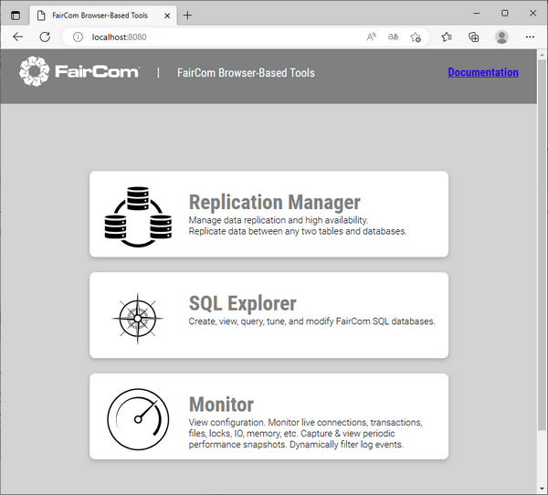

## Web utilities

Web utilities can be reached via HTTP or HTTPS and used within your favourite web browser.

To use these utilities, the HTTPD plugin must be enabled. To enable it:

1. Shutdown the c-tree server, if it’s running
2. Edit the *ctsrvr.cfg* configuration file
3. remove the semicolon before "PLUGIN cthttpd;./web/cthttpd.dll" changing from

```
; Plugins and associated ports are configured in config/services.json
;PLUGIN cthttpd;./web/cthttpd.dll
;
```

to

```
; Plugins and associated ports are configured in config/services.json
PLUGIN cthttpd;./web/cthttpd.dll
;
```

4. Restart the c-tree server

By default, the web server starts on the port 8443 port listening for secure connections (HTTPS), but it uses a self-signed certificate that is marked as not secure by most web browsers. You might consider either to

- install your own certificate, or
- switch to a standard HTTP connection

The port numbers, certificate locations and service enablement can be configured in services.json

```
{
   "listeners": [
   {
      "serviceName": "http8080",
      "description": "Port 8080 using insecure HTTP protocol for REST and Web Apps on all TCP/IP addresses bound to this server",
      "port": 8080,
      "protocol": "http",
      "enabled": false
   },
   {
      "serviceName": "https8443",
      "description": "Port 8443 using TLS-secured HTTPS protocol for REST and Web Apps on all TCP/IP addresses bound to this server",
      "port": 8443,
      "protocol": "https",
      "enabled": true,
      "tls": {
         "serverCertificateFilename": "./web/fccert.pem"
      }
   }
 
   ],
}
 ...
```

After a successful startup, the Faicom’s Replication Manager listens for standard HTTP connections on the port 8080 and for secure HTTP connections on the port 8443.

**Note** - The default ports can be changed by editing the *cthttpd.json* file under the “replication.manager/replicationmanager/config” folder.

Navigate to "https\://localhost:8443" (replacing localhost with the IP address of the server if you’re connecting from a remote machine, and replacing 8443 with the port that you configured in *services.json*) with your favourite web browser to obtain the list of available utilities:



The following utilities are available:

| Utility | URL | Secure URL |
| --- | --- | --- |
| [Data Explorer](./Data-Explorer) | http\://localhost:8080/DataExplorer | https\://localhost:8443/SQLExplorer |
| [Monitor](./Monitor) | http\://localhost:8080/AceMonitor | https\://localhost:8443/AceMonitor |
| [ISAM Explorer](./ISAM-Explorer) | http\://localhost:8080/ISAMExplorer | https\://localhost:8443/ISAMExplorer |
