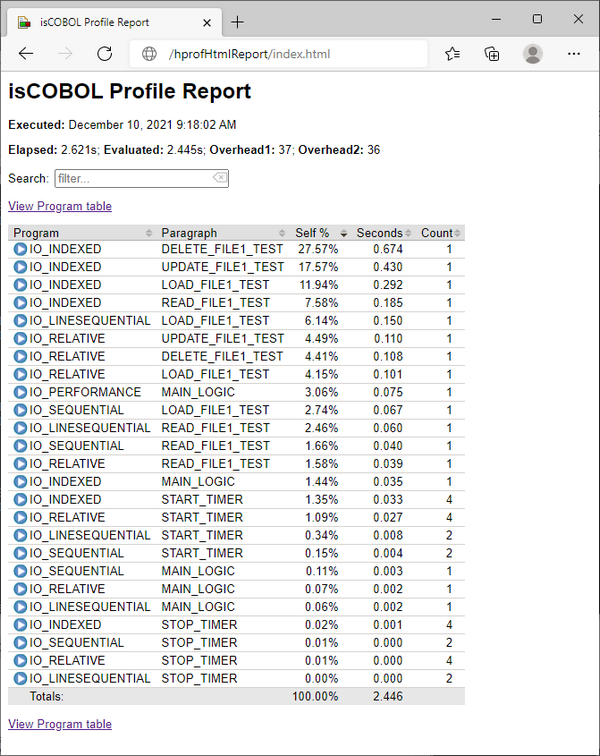
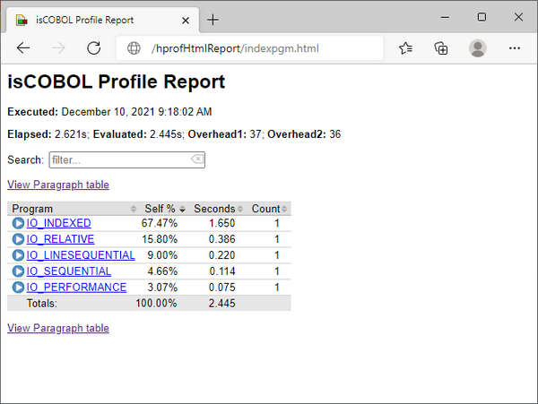
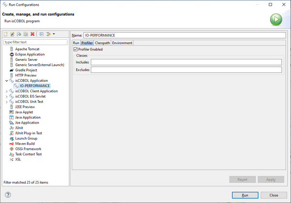
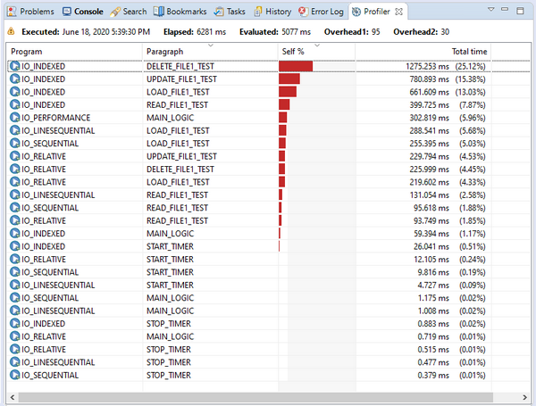

## Profiling COBOL programs

The isCOBOL Framework provides the ability to profile COBOL programs in order to identify which paragraphs or sections have used most of the CPU time.

Before profiling your programs, ensure that you already followed the suggestions from [Compile-time optimizations](./Guidelines-for-better-runtime-performance/Compile-time-optimizations) and [Better run time performance](./Guidelines-for-better-runtime-performance/Better-run-time-performance), e.g. programs are not compiled in debug mode and there is no logging of the runtime activity.

In order to profile the runtime activity, use the [-profile](../../SDK-Users-Guide/Compiler-and-Runtime/Runtime-Framework/Runtime-Options#profile) option, e.g.

```cobol
iscrun -profile IO_PERFORMANCE
```

The above command starts the IO_PERFORMANCE sample installed with isCOBOL (it is located in the folder sample/io-performance of the isCOBOL SDK).

When the runtime session terminates, you will find a folder named hprofHtmlReport in the working directory. Open the file index.html in this folder using your favourite web browser to have a report of the profiled runtime activity.



At the top of the report, the following information is provided:

| Info | Meaning |
| --- | --- |
| Executed | Date and time the runtime session was executed. |
| Elapsed | The real time passed between the profiler startup and the report generation. |
| Evaluated | The time spent executing COBOL paragraphs. |
| Overhead 1 | Estimated overhead in nanoseconds added by the profiler for each paragraph not containing PERFORM/CALL. |
| Overhead 2 | Further estimated overhead in nanoseconds for each PERFORM/CALL. |

For each paragraph the following information is provided:

| Info | Meaning |
| --- | --- |
| Program | Program name. |
| Paragraph | Paragraph/Section name. |
| Self | Ratio between the time spent by the paragraph and the evaluated time . |
| Seconds | Total number of seconds that this paragraph used while being executed one or more times in the runtime session. |
| Count | Number of times the paragraph was executed. |

Paragraphs that used most of the time are on top of the list.

By clicking on "View Program table" you jump to a less detailed report where only programs are listed.



For each program the following information is provided:

| Info | Meaning |
| --- | --- |
| Program | Program name. |
| Self | Ratio between the time spent by the program and the evaluated time. |
| Seconds | Total number of seconds that this program used while being executed one or more times in the runtime session. |
| Count | Number of times the program was executed. |

Programs that used most of the time are on top of the list.

The profile of a program execution is obtained by measuring the time spent in individual paragraphs (excluding the time spent in PERFORM/CALL) and by counting the number of times each paragraph is called.

The profiler adds an overhead that is roughly the same for each paragraph. This overhead is evaluated before the profiling and it is subtracted from the results. However the estimated overhead and the actual overhead can differ from time to time due to the machine status (multitasking, JIT compiler, etc).

If a paragraph has very few statements and it is executed many more times that the other paragraphs, the difference may be relevant and may affect the results accordingly.

The profile will include a row for each instance. That means if a program is called, cancelled then called again or if a program is called in thread, more instances of the same program will be profiled and it will appear multiple times in the profiler output.

Library routines and programs compiled with the [-sysc](../../SDK-Users-Guide/Compiler-and-Runtime/Compiler/Compiler-Options#sysc) option are not listed in the profiler output. Their activity is counted as part of the activity of the paragraph in which they were called.

### Profiler configuration

The command iscrun -profile is influenced by the some configuration properties. See [Profiler Configuration](../../SDK-Users-Guide/Compiler-and-Runtime/Configuration/Configuration-Properties#profiler-configuration) for details.

### The javaagent option

The javaagent option allows you to customize the profiler behavior and activate the profiler where the -profiler option is not available, for example in application server environments or in WEB.

We advise using the -profile option rather than the -javaagent option whenever possible.

The command

```cobol
iscrun -profile IO_PERFORMANCE
```

is equivalent to:

```cobol
iscrun "-J-javaagent:/path/to/isprofiler.jar=profiler;html=hprofHtmlReport" IO_PERFORMANCE
```

**Note** - isprofiler.jar is located in the lib folder of the isCOBOL SDK.

The javaagent option allows you to specify some options to customize the profiler behavior and the resulting report. The syntax is:

```cobol
-J-javaagent:/path/to/isprofiler.jar=profiler;[option1=value1;option2=value2;...;optionN=valueN]
```

Where the available options are:

| Option | Value |
| --- | --- |
| excludes | List of COBOL classes that must not be analyzed by the profiler. Multiple values must be separated by comma. <br><br>Regular expressions can be used to specify a pattern, for example:<br>excludes=SAMPLE,GUI.*<br>will exclude the SAMPLE class and all the COBOL classes whose name starts with "GUI". <br><br>It’s possible to exclude specific program paragraphs by specifying their name after the program name with a double colon separator, for example:<br>excludes=IO_INDEXED<br>will exclude the whole IO_INDEXED program, while<br>excludes=IO_INDEXED::DELETE_FILE1_TEST,IO_INDEXED::UPDATE_FILE1_TEST<br>will exclude only the DELETE_FILE1_TEST and UPDATE_FILE1_TEST paragraphs of the IO_INDEXED program.<br>Excluding specific paragraphs is supported only for standard programs (programs that start with a PROGRAM-ID). <br><br>**Note** - the time spent by excluded classes and paragraphs is counted in the time spent by their parent in the stack. <br><br>By default, all COBOL classes and their paragraphs are profiled. |
| html | Pathname of a folder that will host a report in HTML format. |
| includes <span id="includes"></span> | List of COBOL classes that must be analyzed by the profiler. Multiple values must be separated by comma. <br><br>Regular expressions can be used to specify a pattern, for example:<br>includes=SAMPLE,IO.*<br>will include the SAMPLE class and all the COBOL classes whose name starts with "IO". <br><br>It’s possible to include specific program paragraphs by specifying their name after the program name with a double colon separator, for example:<br>includes=IO_INDEXED<br>will include the whole IO_INDEXED program, while<br>includes=IO_INDEXED::DELETE_FILE1_TEST,IO_INDEXED::UPDATE_FILE1_TEST<br>will include only the DELETE_FILE1_TEST and UPDATE_FILE1_TEST paragraphs of the IO_INDEXED program.<br>Including specific paragraphs is supported only for standard programs (programs that start with a PROGRAM-ID). <br><br>By default, all COBOL classes and their paragraphs are profiled. |
| txt | Pathname of a report file in TXT format |
| xml | Pathname of a report file in XML format |

**Note** - if neither *html*, nor txt, nor xml is specified, then no output is generated, unless you specify an output in the program via [C$PROFILER](../Library-Routines/C$PROFILER/C$PROFILER) routine. You should use only one of these three options, depending on the output type that you prefer.

**Note** - when using the javaagent option, the configuration properties whose prefix is "iscobol.profiler" are ignored; only the above options are considered when using the javaagent option.

For example, in order to profile the IO_PERFORMANCE program excluding the activity of the IO_INDEXED subprogram and generating a text report, you can run:

```cobol
iscrun "-J-javaagent:/path/to/isprofiler.jar=profiler;excludes=IO_INDEXED;txt=hprof.txt" IO_PERFORMANCE
```

### Using Profiler and Code Coverage together

The isprofiler.jar library implements both the Code Coverage and the Profiler, however it’s not possible to use these two features together.

On the iscrun command line, if you specify both the -coverage option and the -profile option, e.g.

```cobol
iscrun -profile -coverage ProgramName
```

an error is shown and the runtime doesn’t start.

Using the javaagent option as follows:

```cobol
-J-javaagent:/path/to/isprofiler.jar=profiler;[option1=value1;option2=value2;...;optionN=valueN];coverage;[option1=value1;option2=value2;...;optionN=valueN]
```

A warning is shown and only the first feature (profiler, in this case) is activated.

### The C$PROFILER library routine

You can customize the profiler behavior and the report files even more by calling the [C$PROFILER](../Library-Routines/C$PROFILER/C$PROFILER) library routine. The routine integrates with the -profiler and the -javaagent options allowing you:

- profile only very specific parts of the codebase (see [CPROF-DISABLE](../Library-Routines/C$PROFILER/CPROF-DISABLE) and [CPROF-ENABLE](../Library-Routines/C$PROFILER/CPROF-ENABLE)),
- set or reset the profiler report file name and format (see [CPROF-SET](../Library-Routines/C$PROFILER/CPROF-SET)),
- stop profiling and generate the profiler report anytime, even if the runtime session is still in progress (see [CPROF-FLUSH](../Library-Routines/C$PROFILER/CPROF-FLUSH)).

### Profiling programs in the IDE

The following Run Configurations allow to activate the profiler:

- isCOBOL Application
- isCOBOL Unit Test

In order to access these Run Configurations, click on *Run* in the menu bar and choose *Run Configurations*....

Switch to the *Profiler* tab, enable the option *Profiler Enabled* and optionally provide the list of programs to include in (or exclude from) the analysys.

This is an example of an isCOBOL Application configured to run with profiler:



Click on the *Run* button to run the program. After the program terminates, the [Profiler](../../../is-cobol-IDE/The-isCOBOL-IDE-Perspective/Profiler) view will appear to show the profiler report:



**Note** - from now on, each time you run this program with the command Run As > isCOBOL Application, the profiler will be enabled. If you don’t need it anymore, access to Run Configurations again and disable the option Profiler Enabled.

### Good practice for an accurate profiling

It’s good practice to profile only back-end programs, if possible. Profiling an interactive program may produce an unreliable report as the time spent by the user while interacting with the program is taken into account as well by the isCOBOL profiler.

If the COBOL application consists of a set of programs that manage the UI and a set of programs that perform processing, then you should consider profiling only the second set of programs. The [iscobol.profiler.includes](../../SDK-Users-Guide/Compiler-and-Runtime/Configuration/Configuration-Properties#profiler_includes) configuration property (or the equivalent [includes](./Profiling-COBOL-programs#includes) javaagent option) might be helpful for this.

If the UI and the backend are mixed together in the same programs, then profiling a subset of programs may not be an option, in which case you can add calls to the [C$PROFILER](../Library-Routines/C$PROFILER/C$PROFILER) library routine to your programs in order to mark the parts of code that should be profiled:

1. set [iscobol.profiler.enable (boolean)](../../SDK-Users-Guide/Compiler-and-Runtime/Configuration/Configuration-Properties#profiler_enable) to false in the configuration or call the [CPROF-DISABLE](../Library-Routines/C$PROFILER/CPROF-DISABLE) function as first operation in your main program
2. call the [CPROF-ENABLE](../Library-Routines/C$PROFILER/CPROF-ENABLE) function before the block of code that you wish to profile and call the [CPROF-DISABLE](../Library-Routines/C$PROFILER//CPROF-DISABLE) function after that block of code.

The above approach is used in the sample code snippet of [C$PROFILER](../Library-Routines/C$PROFILER/C$PROFILER).

### Thin client

In a thin client environment it is possible to profile the application server (isCOBOL Server) activity by starting the server process with the same -*javaagent* option used for the runtime. E.g.:

```cobol
iscserver -J-javaagent:/path/to/isprofiler.jar=profiler;<options>
```

Note that, if neither *html*, nor *txt*, nor *xml* is specified among options, then no output is generated, unless you specify an output in the program via [C$PROFILER](../Library-Routines/C$PROFILER/C$PROFILER) routine. For example, in order to obtain a report in html format, start the isCOBOL Server as follows:

```cobol
iscserver "-J-javaagent:/path/to/isprofiler.jar=profiler;html=hprofHtmlReport"
```

The profiling output is shown when the whole application server is terminated or when the [CPROF-FLUSH](../Library-Routines/C$PROFILER/CPROF-FLUSH) function of [C$PROFILER](../Library-Routines/C$PROFILER/C$PROFILER) is called, and includes the profiling of all clients activities mixed together. Therefore, if you need to profile some programs in a thin client environment you should use a dedicated application server with only one client connected.

### Tomcat and other servlet containers

In a servlet container environment like Tomcat it is possible to profile the programs’ activity by starting the server process with the same -*javaagent* option used for the runtime. Add the following Java option to the startup options of your servlet container:

```cobol
-javaagent:/path/to/isprofiler.jar=profiler;<options>
```

The isprofiler.jar agent implements both the Code Coverage and the Profiler tools. See [Using Code Coverage and Profiler together](../../SDK-Users-Guide/Advanced-Features/isCOBOL-Code-Coverage/Running-an-application-with-isCOBOL-Code-Coverage-from-the-command-line#using-code-coverage-and-profiler-together) for information on how to use them together.

The following libraries should be shared among all the webapps:

- isprofiler.jar
- jacoco-core-0.8.11.jar
- javassist.jar

You can either copy them to the Tomcat’s lib directory or you can add them to the CLASSPATH setting.

When you use profiler features under a servlet container, no report is generated at the closing of the JVM. The generation of the reports is delegated to the [C$PROFILER](../Library-Routines/C$PROFILER/C$PROFILER) library routine:

- Call the [CPROF-SET](../Library-Routines/C$PROFILER/CPROF-SET) function to specify the name of the report file.
- Call the [CPROF-FLUSH](../Library-Routines/C$PROFILER/CPROF-FLUSH) function to stop the profiler activity and generate the report file.

It’s good practice to call these functions in the main program of the servlet or in a ServletContextListener class, so the whole session is analyzed.

It’s strongly suggested to have only one session of the webapp running with profiling. If there are multiple sessions of the same webapp running with profiling, the report will not be accurate as it collects information from multiple sessions.

Example of ServletContextListener written in object oriented COBOL that allows you to profile the webapp activity:

```cobol
       identification division.
       class-id. awebxcontextlistener as 
                    "AwebxContextListener"
                    implements servletcontextlistener.
       environment division.
       configuration section.
       repository.
          class servletcontextlistener as
             "javax.servlet.ServletContextListener"
          class servletcontextevent as
             "javax.servlet.ServletContextEvent"
             .
       identification division.
 
       factory.
       
       working-storage section.
       copy "iscobol.def".
       
       end factory.
       
       identification division.
 
       object.      
 
       procedure division.
       
       identification division.
       method-id. contextInitialized as "contextInitialized".
       linkage section.
       01 evt object reference servletcontextevent.
       
       procedure division using evt.
       main.
            call "c$profiler" using cprof-set "html" 
                             "/tmp/profiler_reports".
            goback.
            
       end method.
       
       identification division.
       method-id. contextDestroyed as "contextDestroyed".
       linkage section.
       01 evt object reference servletcontextevent.
       
       procedure division using evt.
       main.
           call "c$profiler" using cprof-flush.
           goback.
            
       end method.
 
       end object.
 
       end class.
```
