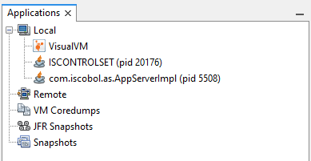
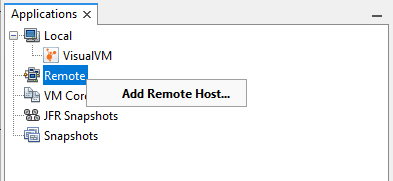
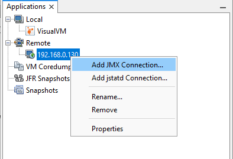
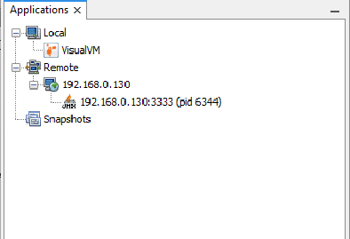

### Launching VisualVM and attaching the Java process

VisualVM is a Java tool itself. The Java Virtual Machine (JVM) behind this tool should be of the same version of the JDK or JRE you’re going to attach and monitor. You can configure the underlying JVM in the file *etc/visualvm.conf*. By default, VisualVM uses the default JVM in the system, that is the first java command found in the system Path.

When VisualVM starts, it lists all the Java applications running on the local machine along with their PID. For example, on a PC where the isCOBOL Demo (ISCONTROLSET) and the isCOBOL Server are running, the list of applications will look like this:



The name of the application may change depending on the command that you used to start it. For example, if you start the isCOBOL Server as a Windows service, using the iscserver wrapper or using the java executable, the name listed in the Applications tab changes as follows:

| command | application name shown in VisualVM |
| --- | --- |
| iscserver.exe (Windows) | C:.Veryant.isCOBOL... |
| Windows service | Local Application |
| iscserver (Linux/Unix) | com.iscobol.as.AppServerImpl |
| java com.iscobol.as.AppServerImpl | com.iscobol.as.AppServerImpl |

In order to monitor the Java process, you have to attach it. Just double click on the application name in the tree or right click on it and choose "Open" from the pop-up menu.

**Note** - the process may not appear in the list if:

- the JDK version from which you started VisualVM is different than the Java version used by isCOBOL Server
- VisualVM was launched with different Administrator privileges than the Java process (Windows only).

### Connecting to a remote Java process

Sometimes it’s not possible to start VisualVM on the same machine where the Java process is running. In this case you have to set up a remote JMX connection. The most common case is where the server is a headless Linux/Unix, where no graphical desktop is available. In this guide we’re going to see how to set up the JMX connection on Linux and how to attach to it from a Windows client. Assume that the IP address of the Linux server is 192.168.0.130.

First, we need to dedicate a port to the JMX connection. In this example, we’re using port 3333.

The following properties must be set on the Java process command line:

- com.sun.management.jmxremote.authenticate=false
- com.sun.management.jmxremote.local.only=false
- com.sun.management.jmxremote.port=3333
- com.sun.management.jmxremote.ssl=false
- com.sun.management.jmxremote.rmi.port=3333
- java.rmi.server.hostname=192.168.0.130

Example with iscserver Linux wrapper:

```cobol
iscserver -J-Dcom.sun.management.jmxremote.authenticate=false \
          -J-Dcom.sun.management.jmxremote.local.only=false \
          -J-Dcom.sun.management.jmxremote.port=3333 \
          -J-Dcom.sun.management.jmxremote.ssl=false \
          -J-Dcom.sun.management.jmxremote.rmi.port=3333 \
          -J-Djava.rmi.server.hostname=192.168.0.130
```

Example with equivalent Java command:

```cobol
java -Dcom.sun.management.jmxremote.authenticate=false \
     -Dcom.sun.management.jmxremote.local.only=false \
     -Dcom.sun.management.jmxremote.port=3333 \
     -Dcom.sun.management.jmxremote.ssl=false \
     -Dcom.sun.management.jmxremote.rmi.port=3333 \
     -Djava.rmi.server.hostname=192.168.0.130 com.iscobol.as.AppServerImpl
```

To add the above properties to a servlet container like Tomcat, you will have to edit its configuration. For example, for Tomcat on Linux, edit the file *$CATALINA_HOME/bin/catalina.sh* and add the line:

```cobol
export JAVA_OPTS="$JAVA_OPTS -Dcom.sun.management.jmxremote.authenticate=false -Dcom.sun.management.jmxremote..."
```

After the Java process has been started,

- run VisualVM on a Windows machine in the same network as your Linux server
- right click on "Remote" in the Applications tree and choose "Add Remote Host..."
- fill the "Host name" field with the IP address of the Linux server and click OK
- the IP address appears as child item of Remote in the tree. Right click on it and choose "Add JMX Connection..."
- in the "Connection" field, put the port number 3333 after the colon and click OK.
- the Java application will appear as a new child in the tree:

In order to monitor the Java process, you have to attach it. Just double click on the application name in the tree or right click on it and choose "Open" from the pop-up menu.
