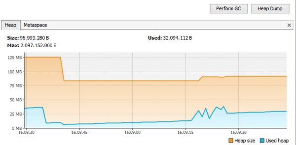
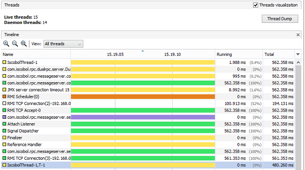

### VisualVM’s graphical interface

VisualVM uses separate pages to let you manage memory and threads. Use the tab-control on the right of the graphical interface to switch between these pages.

### VisualVM’s Overview page

The Overview page provides useful details about the attached JVM, such as version, vendor, command-line arguments and configuration properties.

### VisualVM’s Monitor page

The Monitor page allows you to monitor the CPU and memory usage of the Java process in real time as well as the number of loaded classes and active threads.

You should pay particular attention to the Heap monitor.

The Heap is the amount of RAM memory that is allocated to store resources used by COBOL handles like bitmaps, fonts, ESQL cursors, etcetera. This memory has an initial size that can be configured through the -Xms Java option and a maximum size that can be configured through the -Xmx Java option. The Heap usage increases when the COBOL application loads a new resource and decreases when a garbage collection is performed.

The garbage collection is a procedure that takes care of removing inactive resources (e.g. a font or a bitmap whose handle has been destroyed) from the Heap memory. This procedure is automatically triggered by the JVM when the Heap usage is near the maximum amount of memory available or when the JVM is idle. You can force a garbage collection from the VisualVM screen by clicking the "Perform GC" button. Be aware that this procedure consumes CPU and it may slow down connected clients that are working.

The "Heap Dump" button allows you to take a snapshot of the Heap in a given moment. By analyzing this snapshot you can find out which classes are using most of the memory.



### VisualVM’s Threads page

The Threads page lists all the threads in the JVM. By default all threads are shown, including the ones that are no longer running. You can filter the list using the "View" combo-box on top of the list.

The list includes a timeline that shows how the threads state changes in time. There are five possible states:

| State | Meaning |
| --- | --- |
| Running | The thread is running. In a COBOL application this is the typical state during back-end activity, like a cycle that reads records from a file and processes them. |
| Sleeping | The thread is sleeping. In a COBOL application this is the typical state of a program that called the C$SLEEP routine and is waiting for the call to return. |
| Wait | The thread was blocked by a mutex or a barrier, and is waiting for another thread to release the lock. In a COBOL application this is the typical state of a program that is accepting user input with an ACCEPT statement. |
| Park | Parked threads are suspended until they are given a permit. |
| Monitor | The thread is waiting on a condition to become true to resume execution. |

The COBOL threads in a stand-alone application can be identified by their name:

| | |
| --- | --- |
| main | This is the main thread, the one running the program that was passed as an argument to the isCOBOL Runtime. |
| main,T-# | This is a COBOL thread started from the COBOL application using either CALL THREAD or PERFORM THREAD statements. # is a progressive number assigned by the isCOBOL Framework. |
| main,R-# | This is a COBOL thread started from the COBOL application using the CALL RUN statement. # is a progressive number assigned by the isCOBOL Framework. |
| | |

In a thin client environment, the isCOBOL Clients connected to the isCOBOL Server can be identified by their name:

| | |
| --- | --- |
| IscobolThread-# | This is the main thread of the isCOBOL Client. # is the thread ID (TID) assigned to that Client. You can retrieve more information about the Client whose thread ID is # by running the isCOBOL Server’s administration panel. |
| IscobolThread-#,T-# | This is a COBOL thread started from the COBOL application using either CALL THREAD or PERFORM THREAD statements. The first # is the TID of the Client, while the second # is a progressive number assigned by the isCOBOL Framework. |
| IscobolThread-#,R-# | This is a COBOL thread started from the COBOL application using the CALL RUN statement. The first # is the TID of the Client, while the second # is a progressive number assigned by the isCOBOL Framework. |
| | |

In an EIS environment, the COBOL HTTP sessions can be identified by their name. For example, in Tomcat:

| | |
| --- | --- |
| http-nio-#-exec-# | This is the main thread of the HTTP session. The first # is the port, the second # is a progressive number assigned by Tomcat. |
| http-nio-#-exec-#,T-# | This is a COBOL thread started by either a CALL THREAD statement or a PERFORM THREAD statement. The first # is the port, the second # is a progressive number assigned by Tomcat and the third # is a progressive number assigned by the isCOBOL Framework. |
| http-nio-#-exec-#,R-# | This is a COBOL thread started by a CALL RUN statement. The first # is the port, the second # is a progressive number assigned by Tomcat and the third # is a progressive number assigned by the isCOBOL Framework. |
| | |

**Note** - the T and R letters in the name might be nested. For example, in a thin client environment, if a program called through CALL RUN calls another program in thread and this program creates another thread, you will find something like "IscobolThread-4,R-1,T-1,T2".

A COBOL thread that stays in Running state without changing to Wait or Sleeping for a long time could be in an infinite loop and it could slow down the other threads in the JVM. By collecting a thread dump and looking at the stack of the looping thread, you can find out which program and paragraph are being executed by that thread.

Use the "Thread Dump" button to collect a thread dump.



#### Taking Heap and Thread dumps without VisualVM

If neither VisualVM nor a JMX connection is available on the machine where Java is running, it’s still possible to take a Heap dump or a Thread dump by using command line tools installed in the JDK bin directory.

You just need to know the JVM process ID (PID) in the system. Use system tools to retrieve it, for example, on Linux/Unix you can use the ps command:

```cobol
ps -ef |grep java
```

Once you know the PID of your JVM, use this command to take a Heap dump:

```cobol
jmap -dump:live,format=b,file=/path/to/dump.hprof pid
```

To take a Thread dump, instead, use:

```cobol
jstack pid > /path/to/dump.tdump
```

### VisualVM’s Sampler and Profiler pages

The Sampler and Profiler pages allows you to profile the JVM activity to identify what’s using most of the CPU. However, for profiling COBOL application, Veryant suggests the use of the isCOBOL Profiler, as it provides more high-level and COBOL-oriented information. See [Profiling COBOL programs](../../Performance-Tuning/Profiling-COBOL-programs) for details.
